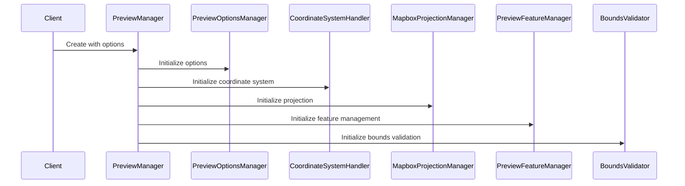
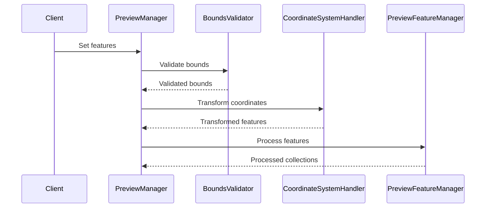
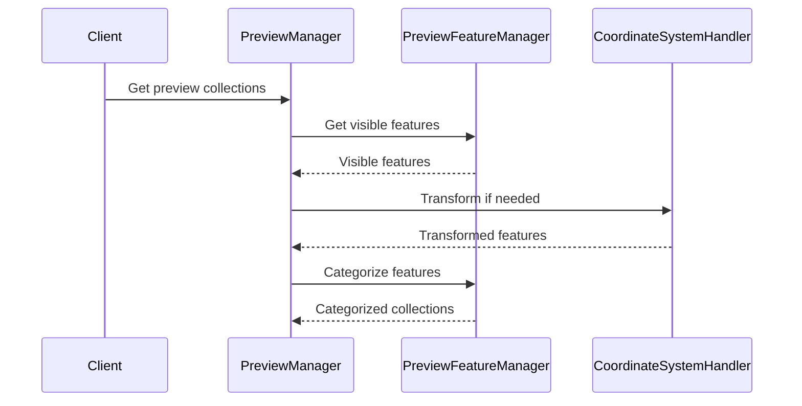

# Preview Manager Architecture

## Overview

The Preview Manager is a modular system designed to handle geographic data preview generation with support for different coordinate systems, caching, and streaming. The system has been structured into specialized modules to improve maintainability, testability, and extensibility.

## Module Structure

```
preview/
├── types/
│   ├── mapbox.ts         # Mapbox projection types
│   └── preview.ts        # Core preview types
├── modules/
│   ├── bounds-validator.ts           # Bounds validation and transformation
│   ├── coordinate-system-handler.ts  # Coordinate system management
│   ├── mapbox-projection-manager.ts  # Mapbox projection configuration
│   ├── preview-feature-manager.ts    # Feature management and processing
│   └── preview-options-manager.ts    # Options management
├── cache-manager.ts      # Caching functionality
└── preview-manager.ts    # Main facade coordinating all modules
```

## Module Responsibilities

### PreviewManager (Facade)
- Acts as the main entry point and coordinator
- Manages the lifecycle of other modules
- Provides a simplified interface for clients
- Handles high-level operations and workflow

### BoundsValidator
- Validates geographic bounds
- Handles bounds transformation between coordinate systems
- Provides default bounds for different systems
- Detects coordinate system mismatches

### CoordinateSystemHandler
- Validates coordinate systems
- Transforms coordinates between systems
- Manages coordinate system state
- Handles coordinate system initialization

### MapboxProjectionManager
- Manages Mapbox projection configuration
- Handles projection changes
- Provides projection information
- Supports different projection types

### PreviewFeatureManager
- Manages feature collections
- Handles feature streaming
- Processes feature categorization
- Manages visible layers

### PreviewOptionsManager
- Manages preview configuration
- Handles option validation
- Tracks option changes
- Provides default configurations

## Application Flow

### 1. Initialization Flow


### 2. Feature Processing Flow


### 3. Preview Generation Flow


## Key Features

### Coordinate System Handling
- Support for multiple coordinate systems (WGS84, Swiss LV95)
- Automatic coordinate transformation
- Coordinate system validation
- System detection and fallback

### Feature Management
- Streaming support for large datasets
- Memory management
- Feature categorization
- Layer visibility control

### Caching
- Preview collection caching
- Cache invalidation on changes
- Configurable cache TTL
- Memory-efficient caching

### Projection Support
- Multiple Mapbox projections
- Projection configuration
- Dynamic projection changes
- Swiss-specific projections

## Error Handling

The system implements comprehensive error handling:
1. Coordinate transformation errors
2. Invalid bounds handling
3. Feature processing errors
4. Cache management errors
5. Memory management

## Performance Considerations

### Memory Management
- Streaming for large datasets
- Configurable memory limits
- Efficient cache management
- Feature chunking

### Processing Optimization
- Smart sampling for large datasets
- Cached transformations
- Efficient feature categorization
- Lazy processing where possible

## Usage Examples

### Basic Usage
```typescript
const manager = new PreviewManager({
  maxFeatures: 1000,
  coordinateSystem: COORDINATE_SYSTEMS.SWISS_LV95,
  enableCaching: true
});

await manager.setFeatures(features);
const collections = await manager.getPreviewCollections();
```

### Coordinate System Change
```typescript
manager.setOptions({
  coordinateSystem: COORDINATE_SYSTEMS.WGS84
});
```

### Layer Visibility
```typescript
manager.setOptions({
  visibleLayers: ['layer1', 'layer2']
});
```

## Extension Points

The modular architecture allows for easy extension:
1. New coordinate systems
2. Additional projection types
3. Custom feature processors
4. Alternative caching strategies
5. New feature types

## Best Practices

1. Always dispose of the manager when done
2. Use streaming for large datasets
3. Enable caching for better performance
4. Handle coordinate system changes properly
5. Validate bounds when setting features
