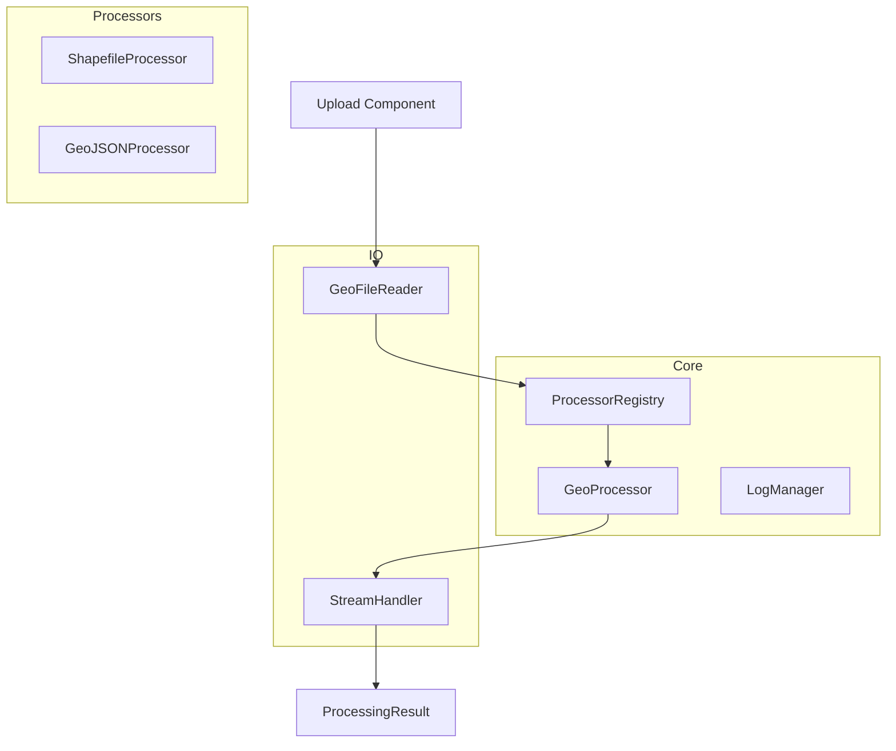

# GeoData Import System Refactor V2

## Implementation Progress

### Phase 1: Core Refactor ✓
1. Created core types and interfaces:
   - `GeoFileUpload` - Represents file data and companions
   - `ProcessingOptions` - Configuration options
   - `ProcessingStatus` - Progress tracking
   - `ProcessingResult` - Operation results
   - `ProcessingError` - Error handling

2. Implemented base processor system:
   - `GeoProcessor` interface
   - `BaseGeoProcessor` abstract class
   - Logging system integration
   - Progress tracking

3. Created processor registry:
   - Singleton pattern
   - Type-based processor lookup
   - Companion file handling
   - Error handling

### Phase 2: IO Utilities ✓
1. Implemented `GeoFileReader`:
   - File grouping by base name
   - Companion file detection
   - Direct file data reading
   - MIME type handling

2. Implemented `StreamHandler`:
   - Chunk-based processing
   - Progress tracking
   - Memory efficient streaming
   - Transform streams

### Next Steps

1. Phase 3: Upload Component ⏳
   ```typescript
   // Next: Update S3FileUpload component
   export function S3FileUpload({ onUpload }: Props) {
     const handleFiles = async (files: FileList) => {
       // Use new GeoFileReader
       const upload = await GeoFileReader.createUpload(files);
       
       // Use new processor system
       const processor = ProcessorRegistry.getInstance().getProcessor(upload);
       const result = await processor.process(upload);
       
       onUpload(result);
     };
   }
   ```

2. Phase 4: Shapefile Processor
   ```typescript
   // Next: Implement ShapefileProcessor
   export class ShapefileProcessor extends BaseGeoProcessor {
     async process(upload: GeoFileUpload): Promise<ProcessingResult> {
       // Use StreamHandler for large files
       const features = await StreamHandler.processStream(
         upload.mainFile.data,
         async chunk => {
           // Process chunk and return features
         }
       );
       
       return {
         features,
         metadata: await this.extractMetadata(upload)
       };
     }
   }
   ```

## Current Architecture



## Key Improvements

1. **Direct Data Handling**
   - Files are read immediately into ArrayBuffers
   - No filesystem dependencies
   - Clear data ownership

2. **Memory Efficiency**
   - Chunk-based processing
   - Streaming support
   - Progress tracking

3. **Better Error Handling**
   - Early validation
   - Clear error messages
   - Type-specific errors

## Next Focus Areas

1. **Upload Component**
   - Integrate with new file reader
   - Add progress tracking
   - Improve error handling

2. **Shapefile Processor**
   - Implement streaming support
   - Handle companion files
   - Add validation

3. **Testing**
   - Unit tests for core
   - Integration tests
   - Performance testing

## Benefits of New Implementation

1. **Direct Data Handling**
   - No more mock data
   - Clear data ownership
   - Type-safe interfaces

2. **Improved Error Handling**
   - Early validation
   - Clear error messages
   - Type-specific errors

3. **Better Testing**
   - No filesystem dependencies
   - Clear boundaries
   - Easy mocking

## Migration Plan

1. **Current Focus** ⏳
   - Implementing file reading utilities
   - Setting up processor infrastructure
   - Creating core interfaces

2. **Next Phase**
   - Update upload component
   - Implement shapefile processor
   - Add tests

3. **Final Phase**
   - Migrate existing code
   - Remove old implementation
   - Update documentation

## Current Issues

1. **Data Flow Problems**
   - File data is lost between upload and processing
   - Empty objects are passed instead of actual file content
   - Mock data is used as a fallback, masking real issues

2. **Architecture Issues**
   - Too many layers of abstraction
   - Unclear responsibility boundaries
   - Complex state management across components

## Proposed Solution

### 1. Direct File Processing Pipeline

```typescript
interface GeoFileUpload {
  mainFile: {
    name: string;
    data: ArrayBuffer;
    type: string;
  };
  companions: {
    [extension: string]: {
      name: string;
      data: ArrayBuffer;
      type: string;
    };
  };
}

interface ProcessingContext {
  mainFile: GeoFileUpload['mainFile'];
  companions: GeoFileUpload['companions'];
  options: ProcessingOptions;
  progress: (status: ProcessingStatus) => void;
}
```

### 2. Simplified Component Structure

```
/geo-loader
  /core
    /processors
      /base
        processor.ts       # Base processor interface
        registry.ts        # Processor registry
      /shapefile
        processor.ts      # Shapefile implementation
        reader.ts         # Raw file reading
        parser.ts         # Data parsing
      /geojson
        processor.ts      # GeoJSON implementation
    /io
      file-reader.ts      # File reading utilities
      stream-handler.ts   # Streaming utilities
    /validation
      schema.ts          # Schema validation
      geometry.ts        # Geometry validation
```

### 3. Processing Flow

1. **File Upload**
   ```typescript
   // Upload component
   async function handleUpload(files: FileList) {
     const upload = await FileUploader.createGeoFileUpload(files);
     const processor = ProcessorRegistry.getProcessor(upload);
     const result = await processor.process(upload);
     return result;
   }
   ```

2. **Processing**
   ```typescript
   // Processor
   class ShapefileProcessor implements GeoProcessor {
     async process(upload: GeoFileUpload) {
       // Direct access to file data
       const shpData = upload.mainFile.data;
       const dbfData = upload.companions['.dbf']?.data;
       const shxData = upload.companions['.shx']?.data;
       
       // Process actual data
       const features = await this.parseShapefile(shpData, dbfData, shxData);
       return features;
     }
   }
   ```

### 4. Key Improvements

1. **Direct Data Access**
   - No more file path resolution
   - No mock data generation
   - Clear data ownership

2. **Simplified State Management**
   - Processing context contains all needed data
   - No global state
   - Clear data flow

3. **Better Error Handling**
   - Early validation of required files
   - Clear error messages about missing data
   - No silent fallbacks to mock data

4. **Improved Testing**
   - Easy to mock file data
   - Clear boundaries for unit tests
   - No filesystem dependencies

### 5. Implementation Plan

1. **Phase 1: Core Refactor**
   - Create new processor interfaces
   - Implement file reading utilities
   - Add validation layer

2. **Phase 2: Upload Component**
   - Update upload handling
   - Implement proper file grouping
   - Add progress tracking

3. **Phase 3: Processors**
   - Implement new shapefile processor
   - Add GeoJSON processor
   - Add other format support

4. **Phase 4: Migration**
   - Create compatibility layer
   - Migrate existing code
   - Remove old implementation

### 6. Example Usage

```typescript
// Upload Component
const handleFileSelect = async (files: FileList) => {
  // Create upload object with actual file data
  const upload = await GeoFileUpload.create(files);
  
  // Get appropriate processor
  const processor = ProcessorRegistry.getProcessor(upload.mainFile.type);
  
  // Process with actual data
  const result = await processor.process(upload, {
    onProgress: (status) => updateProgress(status),
    coordinateSystem: 'EPSG:4326',
    validation: {
      validateGeometry: true,
      repairInvalid: true
    }
  });
  
  return result;
};

// Shapefile Processor
class ShapefileProcessor implements GeoProcessor {
  async process(upload: GeoFileUpload, options: ProcessingOptions) {
    // Validate required companions
    this.validateCompanions(upload.companions);
    
    // Create readers with actual data
    const shpReader = new ShapefileReader(upload.mainFile.data);
    const dbfReader = new DBFReader(upload.companions['.dbf'].data);
    
    // Process features
    const features = [];
    for await (const record of shpReader.records()) {
      const attributes = await dbfReader.getAttributes(record.id);
      features.push(this.createFeature(record, attributes));
      options.onProgress({ processed: features.length });
    }
    
    return features;
  }
}
```

### 7. Benefits

1. **Reliability**
   - No more mock data in production
   - Clear validation of required files
   - Proper error handling

2. **Performance**
   - Direct data access
   - No unnecessary file operations
   - Efficient streaming

3. **Maintainability**
   - Clear component boundaries
   - Easy to test
   - Simple to extend

4. **Developer Experience**
   - Clear data flow
   - Type safety
   - Better debugging

### 8. Migration Strategy

1. **Parallel Implementation**
   - Keep existing code working
   - Implement new system alongside
   - Gradually migrate features

2. **Testing Approach**
   - Unit tests for new components
   - Integration tests for full flow
   - Comparison tests with old system

3. **Rollout Plan**
   - Start with new file uploads
   - Migrate existing files
   - Remove old code

### Next Steps

1. Create new core interfaces
2. Implement file reading utilities
3. Update upload component
4. Add new shapefile processor
5. Create tests
6. Begin migration 