# Geodata Import System Refactoring

## Current Issues
- ~~Coordinate system detection and transformation chain is complex and error-prone~~ ✓ FIXED
- Initial bounds calculation fails before features are properly loaded
- ~~Multiple coordinate system transformations causing precision loss~~ ✓ FIXED
- ~~Inconsistent handling of original vs transformed geometries~~ ✓ FIXED
- Preview map not displaying features correctly

## Ideal Workflow

### 1. File Selection & Analysis
- User selects file(s) for import
- System automatically detects:
  - File format (Shapefile, GeoJSON, KML, etc.)
  - Required companion files (for Shapefiles)
  - ✓ Coordinate system from metadata (PRJ file, CRS definition)
  - ✓ Fallback to feature-based coordinate system detection
  - Data structure (layers, feature types, attributes)

### 2. Data Processing Pipeline

```mermaid
graph TD
    A[File Input] --> B[Format Detection]
    B --> C[Metadata Extraction]
    C --> D[CRS Detection]
    D --> E[Feature Sampling]
    E --> F[Preview Generation]
    F --> G[User Confirmation]
    G --> H[Full Import]
```


#### Steps:
1. **Format Detection & Validation**
   - Identify file format
   - Validate required companion files
   - Check file integrity

2. **Metadata Extraction**
   - Parse file metadata
   - ✓ Extract CRS information
   - Identify layers and attributes

3. **Coordinate System Handling** ✓ IMPLEMENTED
   - ✓ Primary: Use metadata (PRJ file, embedded CRS)
   - ✓ Secondary: Analyze coordinate ranges
   - ✓ Tertiary: Use location-based heuristics
   - ✓ Store original coordinates
   - ✓ Single transformation to display system

4. **Feature Processing**
   - Smart sampling for large datasets
   - ✓ Maintain original geometries
   - ✓ Cache transformed coordinates
   - Progressive loading for large files

5. **Preview Generation**
   - Convert to Mapbox format
   - Generate bounds
   - Create layer structure
   - Handle styling

### 3. User Interface
- Clear coordinate system detection display
- Interactive preview map
- Layer visibility controls
- Progress indicators
- Error handling with clear messages
- Import options (full/partial dataset)

## Implementation Plan

### Phase 1: Core Restructuring ✓ COMPLETED
- [x] Create new coordinate system detection service
  - Implemented in `detector.ts`
  - Supports metadata, coordinate analysis, and heuristic detection
  - Confidence scoring for detection methods
- [x] Implement unified geometry processor
  - Implemented in `transformer.ts`
  - Single transformation chain
  - Maintains original geometries
- [x] Develop feature sampling system
  - Integrated with coordinate detection
  - Smart bounds calculation
- [x] Build transformation cache
  - Implemented in `cache.ts`
  - Performance optimization
  - Memory management
  - Cache statistics

### Phase 2: Data Pipeline
- [x] Create modular file processors
  - [x] Shapefile processor implemented
  - [x] GeoJSON processor implemented
  - [ ] KML processor pending
- [x] Implement streaming for large files
- [x] Build preview generator
  - [x] Feature sampling with multiple strategies
  - [x] Coordinate transformation
  - [x] Layer structure generation
  - [x] Style generation
- [x] Add progress tracking

### Phase 3: UI Improvements
- [x] Enhance preview map
  - [x] Integrate with preview generator
  - [x] Add layer controls
  - [x] Implement style customization
  - [x] Add interactive bounds adjustment
  - [x] Support multiple geometry types
- [x] Add layer controls
  - [x] Layer visibility toggles
  - [x] Style customization per layer
  - [x] Attribute inspection
  - [x] Feature count display
- [ ] Improve error display
- [ ] Add import options

## File Structure
```
components/
  geo-loader/
    core/
      coordinate-systems/
        detector.ts        ✓ Implemented
        transformer.ts     ✓ Implemented
        cache.ts          ✓ Implemented
        coordinate-system-manager.ts ✓ Updated
      processors/
        base.ts           # Base processor
        shapefile.ts      # Shapefile processor
        geojson.ts        # GeoJSON processor
        kml.ts            # KML processor
      preview/
        generator.ts      # Preview generator
        sampler.ts        # Feature sampler
    ui/
      import-dialog/
      preview-map/
      layer-controls/
```

## Migration Strategy
1. ✓ Create new services alongside existing ones
2. ✓ Gradually migrate functionality
3. Test with various data types
4. Switch to new system when stable

## Progress Tracking

### Current Status
- [x] Core restructuring completed
- [x] Initial documentation created
- [x] Test cases identified
- [x] Coordinate system detection implemented
- [x] Transformation system refactored
- [x] Caching system implemented
- [x] File processors implemented
  - [x] Shapefile processor
  - [x] GeoJSON processor
  - [ ] Additional formats pending
- [x] Preview generation system implemented
  - [x] Smart feature sampling
  - [x] Style generation
  - [x] Layer management
- [x] UI components implemented
  - [x] Interactive preview map
  - [x] Layer management controls
  - [ ] Error handling improvements pending
  - [ ] Import options pending

### Next Steps
1. ✓ ~~Implement coordinate system detector~~
2. ✓ ~~Create unified geometry processor~~
3. ✓ ~~Build feature sampling system~~
4. ✓ ~~Develop transformation cache~~
5. ✓ ~~Implement file processors~~
6. ✓ ~~Create preview generator~~
7. ✓ ~~Enhance UI components~~
8. Implement error handling improvements
9. Add import options UI

## Notes
- ✓ Keep original geometries intact
- ✓ Single transformation chain
- ✓ Better error handling
- Progressive loading for large files
- Clear user feedback

## Testing Strategy
1. Unit tests for each component
   - Detector tests
   - Transformer tests
   - Cache tests
2. Integration tests for pipeline
3. Test with various data types:
   - Shapefiles
   - GeoJSON
   - KML
   - Large datasets
   - Different coordinate systems

## Future Considerations
- Support for more formats
- Advanced styling options
- Batch processing
- Export capabilities

## Implementation Details

### Coordinate System Detection
The new detection system uses a three-tier approach:
1. **Metadata Detection**
   - Parses PRJ files and CRS definitions
   - Highest confidence level (0.9)
   - Fast and reliable when metadata is available

2. **Coordinate Analysis**
   - Analyzes coordinate ranges and patterns
   - Medium confidence level (0.7-0.8)
   - Uses system-specific bounds validation

3. **Location Heuristics**
   - Pattern matching for specific systems
   - Lower confidence level (0.5-0.6)
   - Fallback when other methods fail

### Transformation System
The new transformer provides:
- Single-step transformations
- Automatic proj4 initialization
- Geometry preservation
- Efficient caching
- Proper error handling

### Caching System
Implements:
- Memory-efficient storage
- Automatic cache invalidation
- Usage statistics
- Performance monitoring
- Thread-safe operations

### Preview Generation System
The preview generation system consists of two main components:

1. **Feature Sampler**
   - Smart sampling strategies:
     - Random sampling with seed support
     - Grid-based spatial sampling
     - Cluster-based sampling (planned)
   - Preserves geometry type distribution
   - Maintains attribute value ranges
   - Supports weighted sampling

2. **Preview Generator**
   - Coordinate system transformation
   - Geometry simplification
   - Layer structure creation
   - Style generation:
     - Automatic color schemes
     - Property-based styling
     - Categorical and numerical value handling

### UI Components
The UI system consists of two main components:

1. **Preview Map**
   - Interactive Mapbox GL JS integration
   - Dynamic layer management
   - Real-time style updates
   - Bounds adjustment
   - Navigation controls
   - Multiple geometry type support

2. **Layer Controls**
   - Layer visibility toggles
   - Style customization:
     - Color picker
     - Opacity slider
   - Layer information display:
     - Geometry type
     - Feature count
     - Attribute list
   - Expandable/collapsible interface 